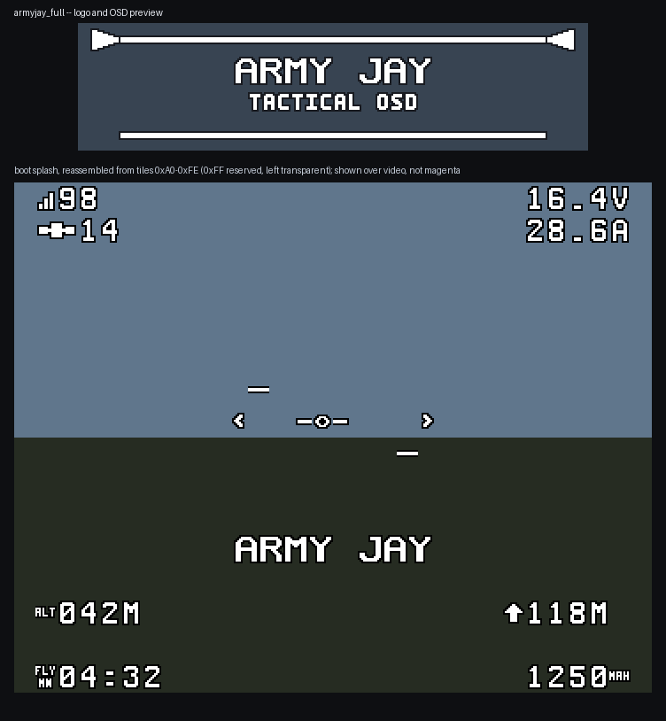

# Army Jay OSD

A Betaflight **analog** OSD font in an Army Jay military/tactical pixel-art
style. Bold stencil letterforms, chunky icons, every white shape carrying a
black outline so it reads over bright sky and dark ground alike.

Primary target is a BetaFPV Air75 (analog, MAX7456-class OSD), but the
output is plain `.mcm` and works with any Betaflight build that has an
analog OSD.



---

## Download

Grab one `.mcm` from [`fonts/`](fonts/) and upload it through Betaflight
Configurator's Font Manager.

| File | Letters & numbers | Icons | Pick this if |
|---|---|---|---|
| [`armyjay_full.mcm`](fonts/armyjay_full.mcm) | Army Jay stencil | Army Jay | **Start here.** The flagship look. |
| [`armyjay_clean.mcm`](fonts/armyjay_clean.mcm) | Army Jay stencil | Close to stock silhouettes | You want the new type but your eyes already know where the stock icons are. |
| [`armyjay_highreadability.mcm`](fonts/armyjay_highreadability.mcm) | Doubled black surround | Simplified, detail removed | Long range, weak signal, or a lot of noise in the feed. |

Three more files ending `_craftname.mcm` exist for the Betaflight 4.4
in-flight logo trick. **Do not install one unless you have read
[In-flight logo](#in-flight-logo) below** — they overwrite ten punctuation
glyphs.

Per-variant glyph sheets and OSD mock-ups are in [`previews/`](previews/).

### What "high readability" actually changes

It thickens the **black surround** on every letter and digit, not the white
strokes. At a 12 px cell the counters close if the strokes grow — a filled-in
`8` or `B` is worse than a thin one. Contrast is what degrades on an analog
feed, so contrast is what the variant buys. Icons lose internal detail on the
same reasoning. Nothing is widened in the AH ladder or progress bar, whose
segments would merge.

---

## Install

1. Connect the flight controller to Betaflight Configurator.
2. **Props off. Always.**
3. Some boards need a LiPo connected to power the OSD chip during upload —
   USB 5 V alone may not bring it up. If Font Manager reports an upload
   failure or the glyphs come back garbled, this is usually why.
4. OSD tab → Font Manager → Open Font File → pick the `.mcm` → Upload Font.
5. Reboot the flight controller.

Nothing about a font upload touches your tune, rates, or modes. It writes
to the OSD chip's character memory only.

### Backup and recovery

Before you flash anything:

- **Save your config.** CLI tab → `diff all` → copy the output into a file.
  This does not back up the font (fonts cannot be read back off the chip),
  but it is the thing you would actually miss.
- **The stock font is always recoverable.** Font Manager ships the stock
  presets: pick `default` in the dropdown and upload it to go back. The
  originals also live in the Configurator repo at `resources/osd/2/`, and a
  copy is vendored here at
  [`assets/references/stock/default_v2.mcm`](assets/references/stock/default_v2.mcm).
- Restoring is the same procedure as installing. There is no state to undo.

If the OSD shows garbage after an upload, re-upload — a partial write is the
usual cause, and it is not persistent damage.

---

## In-flight logo

The boot splash shows the full `ARMY JAY / TACTICAL OSD` card at power-up.
To also show the wordmark **while flying**, the method depends on your
firmware version.

### Betaflight 4.5 and newer — OSD Custom Elements (preferred)

Point a Custom Element straight at the wordmark glyphs. No compromises,
nothing sacrificed.

The wordmark is glyph indexes **`0xBF` to `0xC8`** (10 tiles). In the OSD
tab, add a Custom Element and set ten static glyph parts to those indexes in
order, then place it on screen.

These are splash tiles that already exist, so the in-flight logo costs
**nothing** — the same tiles draw the boot card and the in-flight wordmark.

### Betaflight 4.4 and earlier — craft name (optional, costs glyphs)

On 4.4 and earlier there are no Custom Elements, and the craft-name field
can only reach glyphs at *typeable ASCII* indexes. Showing the wordmark
therefore means moving those tiles onto punctuation slots and giving up
those characters.

That is what the `*_craftname.mcm` builds do. To use one:

1. Upload `armyjay_full_craftname.mcm` (or the clean / high-readability
   equivalent).
2. Set the craft name to exactly:

   ```
   !"#%&'()*;
   ```

3. Enable the Craft Name element in the OSD tab and place it.

**You lose these ten glyphs:** `!` `"` `#` `%` `&` `'` `(` `)` `*` `;`.
They were picked because an OSD almost never needs them, but if you use any
of them in a warning string or a craft name, pick a different variant. The
full mapping is in
[`MODIFIED_INDEXES.md`](MODIFIED_INDEXES.md#craft-name-variant-betaflight-44-and-earlier).

This is a variant, not the default, precisely because it costs something.

---

## Not in scope

HD/digital OSD fonts. DJI, HDZero and msp-osd use 24 × 36 BMP or `.bin`
formats — a different problem entirely.

---

## The format

Verified against the stock fonts vendored in `assets/references/stock/`,
not taken on faith.

| | |
|---|---|
| Encoding | plain ASCII, LF line endings |
| Line 1 | `MAX7456` |
| Lines 2–16385 | 16,384 lines of exactly 8 `0`/`1` characters, one byte each |
| Total | 256 glyphs × 64 bytes = 16,384 bytes |
| Trailing newline | none — the final byte line is unterminated |

A stock font is 147,463 bytes. `wc -l` reports **16384**, not 16385, because
it counts newlines and the last line has none.

**Glyph geometry.** 12 px wide × 18 px tall = 216 pixels, left-to-right,
top-to-bottom. 2 bits per pixel, 4 pixels per byte → 54 bytes of real data,
padded to 64 with `0x55`.

| Bits | Meaning | ASCII art |
|---|---|---|
| `00` | black | `-` |
| `10` | white | `#` |
| `01` | transparent | `.` |
| `11` | transparent | accepted on read, never emitted |

---

## Glyph map policy

Targets the latest Betaflight glyph map. Newer maps are supersets — older
firmware simply never references the newer indexes — so targeting latest
maximizes compatibility. All 256 indexes are explicitly defined; the build
fails loudly on any undefined index rather than silently shipping a blank.

**Protected indexes**, copied verbatim from stock and never drawn on:

| Index | Why |
|---|---|
| `0x00` | blanks the screen on video initialization |
| `0xFF` | reserved (`SYM_END_OF_FONT`) |

**Two places the handoff spec met reality and reality won.** Both are
recorded in [`glyphs/glyph_map.py`](glyphs/glyph_map.py):

- **`0x60`–`0x7E` are not lowercase ASCII.** Betaflight's analog OSD is
  uppercase-only; that whole block is direction arrows and unit icons in
  every stock font. "Keep ASCII meanings through `0x7E`" cannot be applied
  literally without breaking the firmware. ASCII is preserved through
  `0x5F`, where Betaflight preserves it.
- **`0x24` draws `MAX`, not a checkered flag.** The firmware header calls it
  `SYM_CHECKERED_FLAG`, but every stock font draws the word `MAX` there, so
  that is what pilots see. The art follows stock.

The complete 256-index table is in
[`MODIFIED_INDEXES.md`](MODIFIED_INDEXES.md).

---

## Building from source

Python 3.11+. Pillow is the only dependency, and only for rendering — the
encode, decode and validate path is stdlib-only.

```bash
pip install -r requirements.txt

python tools/build_font.py --craft-name    # fonts/*.mcm
python tools/validate.py fonts/*.mcm       # acceptance checks
python tools/build_previews.py             # previews/*.png
python tools/gen_modified_indexes.py       # MODIFIED_INDEXES.md
python -m unittest discover -s tests       # 63 tests

# Verify against Betaflight Configurator's own parser (see below)
python tools/crosscheck_configurator.py
```

Other useful entry points:

```bash
# Decode any font to reviewable ASCII art, or to PNGs
python tools/mcm_decode.py fonts/armyjay_full.mcm -i 0x41
python tools/mcm_decode.py fonts/armyjay_full.mcm --png out/ --sheet sheet.png

# Redraw the boot splash, then re-slice it into tiles
python tools/make_logo.py
python tools/slice_logo.py
```

### How the art is authored

Glyphs are 12 × 18 ASCII art in Python modules — `.` transparent, `#` white,
`-` black — so the whole font is diffable and reviewable in a terminal:

```python
0x41: """
............
....-##-....
...-####-...
..-##--##-..
...
"""
```

Shapes are sketched **white-only** and outlined by `tools/outline_art.py`;
the outlined result is what gets committed, so the shipped art is the
reviewable art. Check 10 enforces that every white pixel keeps its black
surround, so a later hand-edit cannot quietly break the rule.

`glyphs/numbers.py` shadows the standard library's `numbers` module if
`glyphs/` is ever put directly on `sys.path`, which breaks `decimal`,
`fractions` and Pillow. Always import it as `glyphs.numbers`. There is a
test for this.

### Acceptance checks

`tools/validate.py` exits non-zero if any fail, so it drops straight into CI.

| # | Check |
|---|---|
| 1 | 16,385 lines, `MAX7456` header, 8 binary chars per line |
| 2 | All 256 indexes defined; coverage table printed |
| 3 | Padding bytes are `0x55` for every glyph |
| 4 | No `11` pixel pairs emitted |
| 5 | encode → decode → encode is byte-identical |
| 6 | Decoded ASCII art re-renders to the same pixels |
| 7 | `0x00` and `0xFF` match stock |
| 8 | Changed indexes match what `MODIFIED_INDEXES.md` declares |
| 9 | In-flight tile range is nested in the splash block and clear of `0xFF` |
| 10 | House style: no white pixel touches transparent |

The vendored stock fonts are third-party art: they are held to the format
checks but exempt from 8 and 10.

### Cross-checked against Configurator itself

`tools/validate.py` checks the fonts against *our* understanding of the
format. That proves consistency, not correctness. So the build also runs
every font through **Betaflight Configurator's own source** — not a
reimplementation of it:

```bash
git clone --depth 1 https://github.com/betaflight/betaflight-configurator
python tools/crosscheck_configurator.py --configurator betaflight-configurator
```

It loads `FONT.parseMCMFontFile` and `FONT.msp.encode` from
`src/js/utils/osdFont.js`, and `imageToCharacter` from
`src/js/LogoManager.js`, and asserts:

| What | Result |
|---|---|
| Configurator parses each font | 256 characters, all six variants |
| Every pixel, vs our decoder | 216 px × 256 glyphs, exact |
| `MSP_OSD_CHAR_WRITE` payloads | 256 payloads of 1 + 54 bytes, exact |
| Padding decodes as transparent | 40 trailing values × 256 |
| Boot splash PNG re-uploaded through Font Manager | reproduces the 96 tiles in the `.mcm` byte-identically |

That last row is the one worth having: it means uploading
`assets/logo_288x72.png` through Font Manager's boot-logo uploader produces
exactly the tiles already baked into the font. The splash and the in-flight
wordmark cannot disagree.

Two independent implementations agreeing is the strongest verification
available without a flight controller on the bench. It runs in CI, and it
skips cleanly if the checkout or Node is missing.

---

## Repo layout

```
.
├── fonts/                 built .mcm files — the deliverable
├── glyphs/                ASCII-art glyph sources
│   ├── glyph_map.py       all 256 indexes, named and described
│   ├── letters.py numbers.py punctuation.py icons.py
│   ├── icons_clean.py icons_simplified.py    variant overrides
│   └── logo.py            boot splash tiles, sliced from the raster
├── assets/
│   ├── logo_288x72.png    boot splash source raster
│   └── references/        decoded stock fonts, reference only
├── previews/              glyph sheets and OSD mock-ups
├── tests/                 63 tests
├── tools/
│   ├── mcm_encode.py      glyph model + encoder (owns the format spec)
│   ├── mcm_decode.py      parser, ASCII dump, PNG export
│   ├── validate.py        acceptance checks
│   ├── build_font.py      variants.toml → fonts/*.mcm
│   ├── make_logo.py       draws assets/logo_288x72.png
│   ├── slice_logo.py      raster → glyphs/logo.py
│   ├── outline_art.py     white sketch → outlined art
│   ├── render.py          shared rasterisation
│   ├── build_previews.py  previews/*.png
│   └── gen_*.py           regenerate the glyph modules and the index table
├── variants.toml          variant definitions
├── MODIFIED_INDEXES.md    generated: every index and what was drawn
└── STATUS.md              build notes and verified findings
```

---

## Attribution and license

`assets/references/stock/*.mcm` are the stock analog OSD fonts from
[betaflight-configurator](https://github.com/betaflight/betaflight-configurator)
(`resources/osd/1/default.mcm` and `resources/osd/2/default.mcm`, commit
`505bd6d`), vendored unmodified so the round-trip tests are reproducible
offline. Betaflight Configurator is GPL-3.0; those two files are the
Betaflight project's, not this one's, and are included as a reference and
test fixture. No stock glyph art is used as a build base — the only bytes
that reach a built font from stock are the two protected indexes.

The Army Jay glyph art, the boot splash and the tooling in this repository
are original work, dual-licensed — see [`LICENSE`](LICENSE):

- **Code** (`tools/`, `tests/`, `variants.toml`, CI) — MIT.
- **Font art** (`glyphs/`, `fonts/*.mcm`, `assets/logo_288x72.png`,
  `previews/`) — CC BY 4.0. Share it, remix it, ship it commercially; just
  credit *Army Jay OSD*. Attribution rather than share-alike, so swapping a
  glyph does not drag a copyleft obligation onto your config.

These are sensible community defaults picked for the project, not legal
advice, and they are the author's to change — editing `LICENSE` is all it
takes. Nothing in the build depends on the choice.

This repository previously held **EdgeSounds**, an in-browser EdgeTX `.wav`
converter, which was MIT licensed. Its full history is preserved in git —
see commits up to `7c66ca0`.
